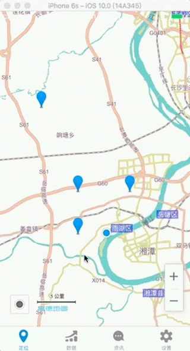

# 塔机数据监控系统

## 1 项目介绍
> 本项目是基于React Native的一款APP。后端采用PHP的ThinkPHP框架做数据与逻辑的处理，前端采用网页（后台）和IOS APP（前台），数据库为MySQL。

### 1.1 基本流程思路：
1. 塔机上的安装了很多传感器，这些传感器采集塔机运行时的实时数据。
2. 采集到的数据传输给塔机上的主控平台（ARM9）。
3. 主控平台处理数据之后，再通过总线再传给DTU(Data Transfer unit)。
4. DTU使用HttpClient模式将数据发送给指定的服务器。
5. 服务器端将数据写入数据库。
6. 客户端读取数据库内容。

### 1.2  实现的功能
- 地图定位：根据塔机上的GPRS模块发送的数据实现塔机在地图上的实时定位，通过手机上的GPS可以获取用户的地理位置信息，并实现用户当前位置到塔机当前位置的导航。
- 数据监控：实时监控塔机的起重重量、起升高度、变幅幅度、起重力矩、回转角度、风速等数据。实时监控并统计塔机各关键位置的限位器报警情况。查询不同塔机的工作历史数据，包括：工况信息等数据，塔机累积工作时长，塔机锁机状态和塔机SIM卡服务状态并以图表的形式显示。查询塔机的基本参数数据，包括：塔机力矩特性曲线、起重臂臂长、平衡臂臂长、吊高高度、前桅距离，后桅距离、额定起重重量、额定起升高度、额定变幅幅度、额定起重力矩、额定回转角度、额定风速等。
- 文章推送：后台可以编辑和推送文章供客户端阅读查询，文章的形式包括但不局限于：各塔机详细资料、公司新产品信息、塔机维护修理和保养资料、塔机事故新闻、广告等。
- 用户设置：用户可以自行修改登录密码、用户名、邮箱、手机号等基本信息，同时可以展示授权状态、公司地址等详细信息。用户可以发送信息反馈给后台系统。

### 1.3 使用的库和第三方插件：

- APP：

react-native-percentage-circle

react-native-pull

react-native-search-bar

react-native-splash-screen

react-native-storage

react-native-swiper

react-native-vector-icons

PHPMailer

echarts

- 后台：

PHPExcel

Bootstrap

Layer

Uploadify

Jquery

## 2 目录结构

```
├── Application  // 后台和APP主文件
│   ├── Admin        // 后台的Controller层和View层
│   ├── Common       // 前后台共用的Model层和公共函数
│   ├── Home         // 前台APP
│   │   ├── Controller      // APP的Controller
│   │   └── View/towerCrane // APP的View
│   │   │   ├──ios_views         // React-Native各模块组件
│   │   │   │   ├──common           // 共用方法
│   │   │   │   ├──data             // 数据展示模块
│   │   │   │   ├──map              // 地图定位模块
│   │   │   │   ├──read             // 资讯模块
│   │   │   │   ├──setting          // 设置模块
│   │   │   │   ├──indexPage.js     // 主页面
│   │   │   │   └──loginPage.js     // 登录页面
│   │   │   ├──index.ios.js      // ios端入口文件
│   │   │   ├──map.html          // 定位模块的webView页面
│   │   │   └──historyData.html  // 历史数据的WebView页面
│   └── Runtime	     // 运行时缓存
├── Image        // 项目效果演示的GIF
├── Public       // 后台使用到的JS文件、JS库、CSS文件和图片等
├── ThinkPHP     // ThinkPHP框架的文件，和PHP第三方库
├── Uploads      // 后台上传的Excel文件
├── index.php    // ThinkPHP入口文件
```

## 3 前台部分介绍
### 3.1 功能演示
- 启动与启动


- 塔机定位和导航



- 塔机数据展示


- 资讯页面


- 设置页面


